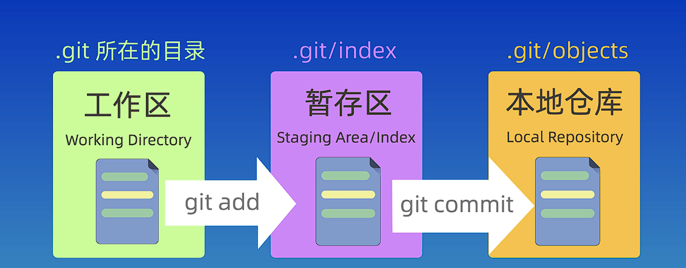
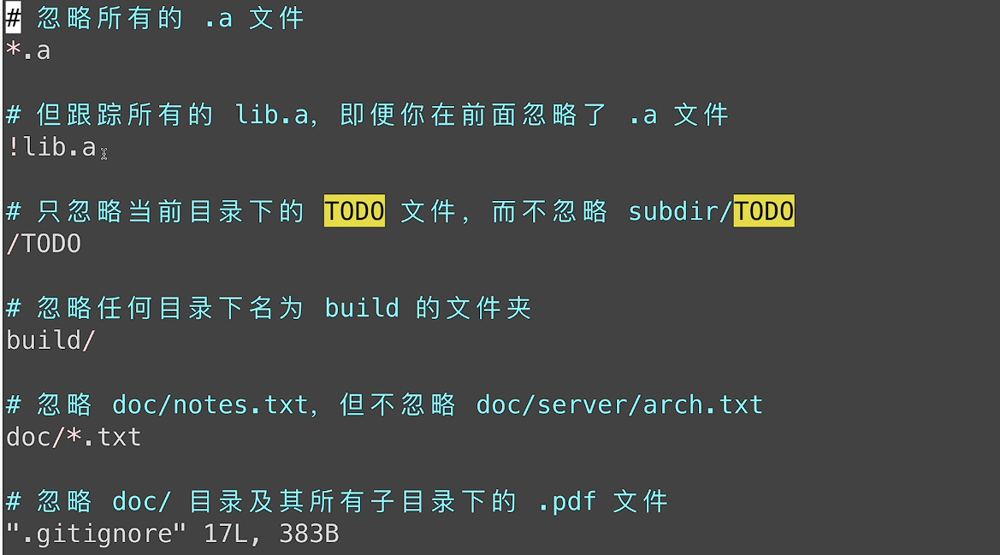
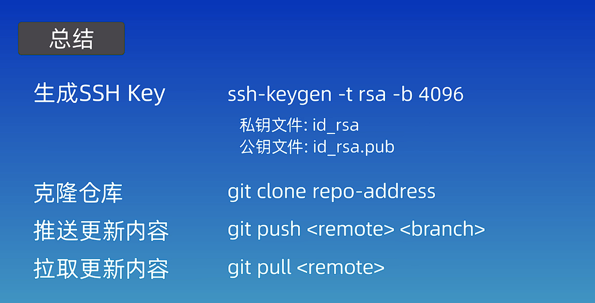
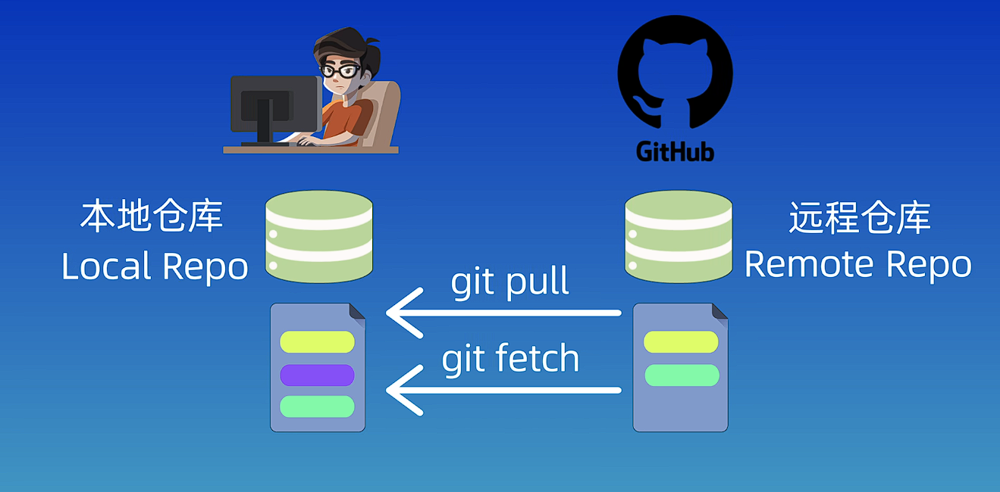
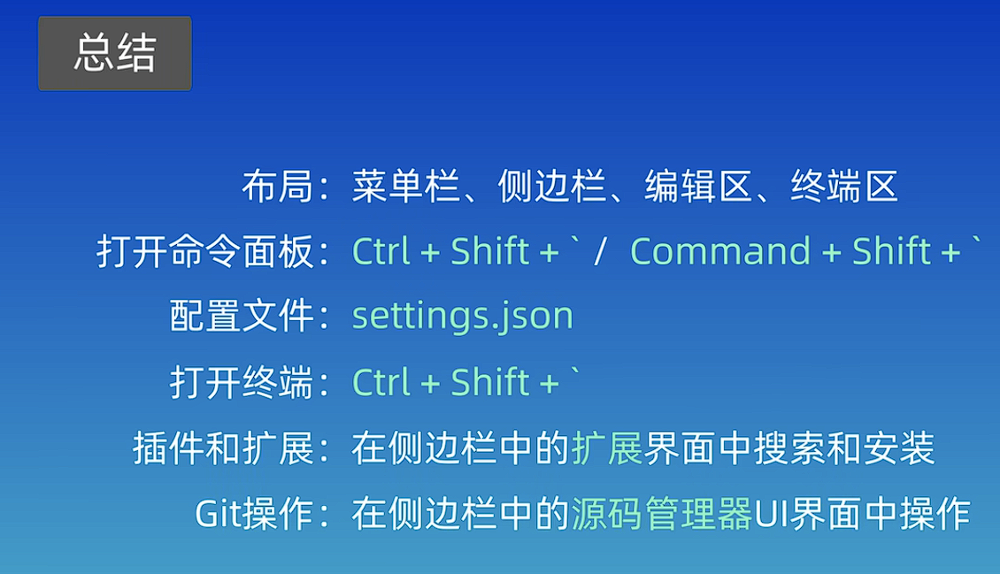
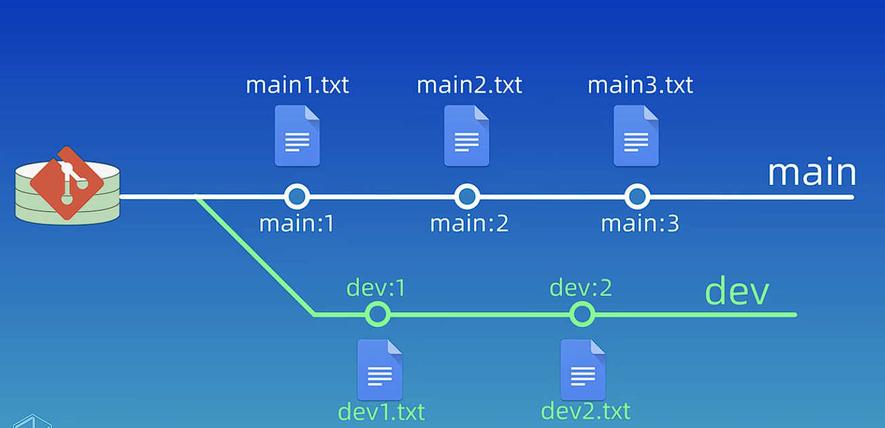
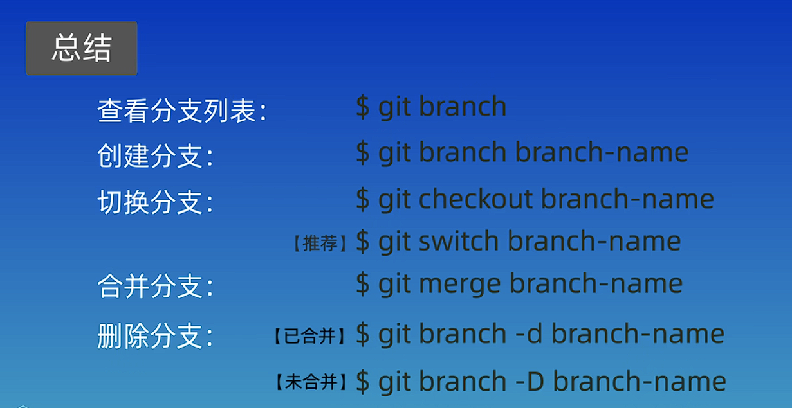
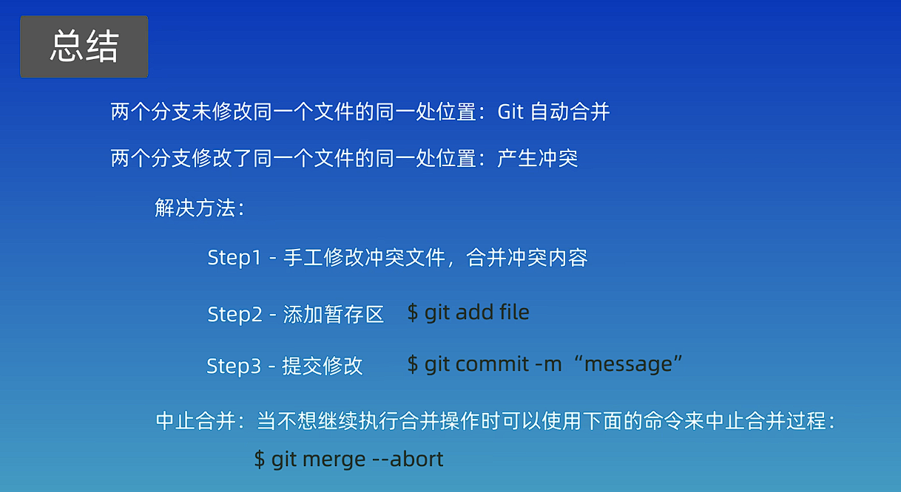
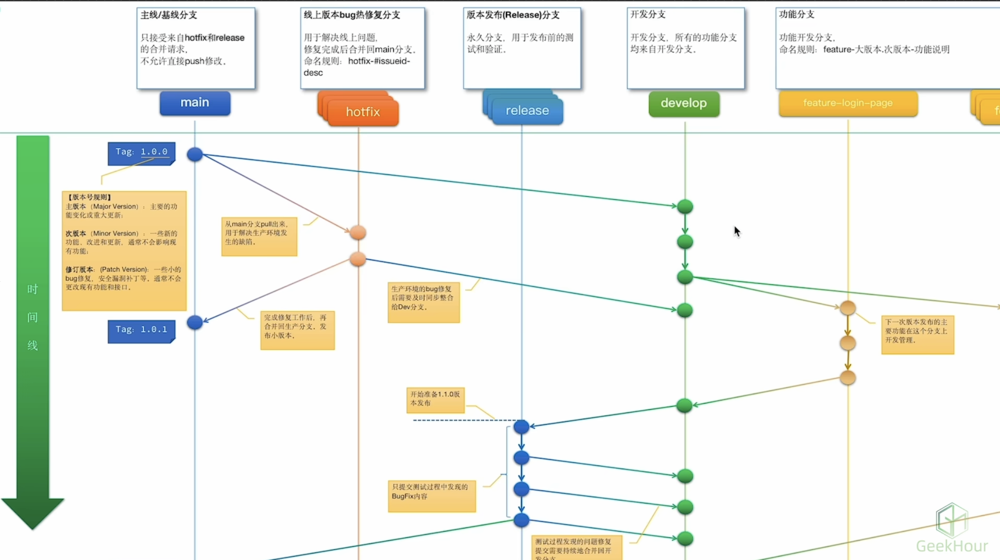
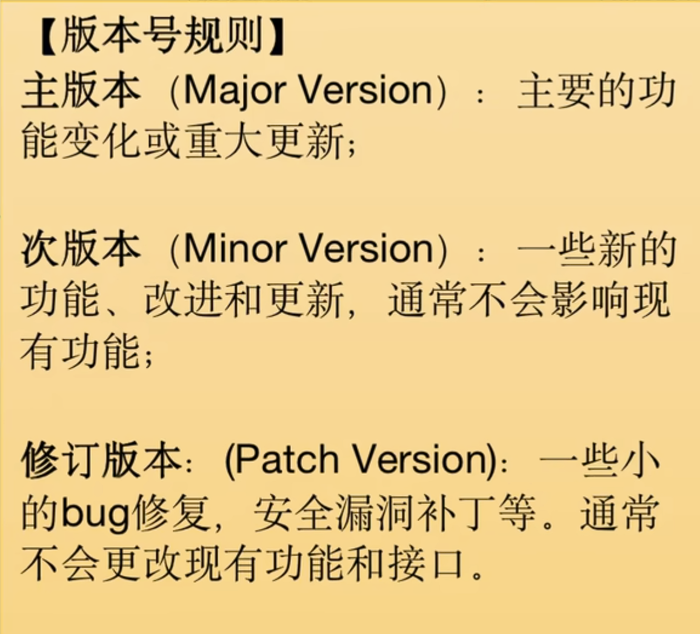

# Git学习笔记

---

## 1.查看版本

命令

`git -v`

---

## 2.配置

命令

`git config --global user.name "xxx"`

`git config --golbal user.email "xxx@gmail.com"`

`git config --golbal credential.helper store`

`git config --golbal --list`

---

## 3.版本库管理

---

一、*本地创建仓库命令*

创建文件夹：`mkdir gitlearn`

切换目录：`cd gitlearn`

本地目录改为仓库（创建仓库）：`git init`

显示目录下文件：`ls`

显示目录下全部文件（包含隐藏文件）：`ls -a`

查看.git文件夹内容：

```cd .git```

```ls -altr```

删除仓库：`\rm -rf .git`

---

二、*远端克隆仓库*

克隆远程仓库：`git clone https://github.com/StarsRicky/private.git`

---

## 4.工作区域和文件状态

一、工作区域

工作区：.git所在的目录

暂存区：.git/index

本地仓库：.git/objects



---

二、文件状态

未跟踪：Untrack

未修改：Unmodified

已修改：Modified

已暂存：Staged

 

---

## 5.添加和提交文件

创建仓库：`git init`

查看仓库的状态：`git status`

添加到暂存区：`git add`

提交：`git commit -m "第一次提交"`（`-m "xxx"`可以不写）

创建文件：`echo "这是第一个文件" > file1.txt`

显示文件：`ls`

查看文件：`cat file1.txt`

更改文件名称（重命名：`mv file1.txt file.txt`（前面是文件名，后面是修改后的名字）

添加当前目录所有文件：`git add .`

提交文件：`git commit`

查看提交记录：`git log`（详细信息）/`git log --oneline`（简洁信息）


---

## 6.git reset回退版本

git reset三种模式

`git reset-soft <版本号>`

`git reset-hard <版本号>`

`git reset-mixed <版本号>`


复制文件命令：`cp -rf repo repo-soft`

回退上一个版本：`git reset-hard HEAD^`  /  `git reset-hard HEAD^`

查看工作区内容：`ls`

查看暂存区内容：`git ls-files`

查看操作记录：`git reflog`

回退历史版本操作：`git reset --hard <版本号>`

---

## 7.使用git diff查看差异

编辑文件：`vi file.txt`

vim编辑：

编辑按键：`i`

退出编辑按键：`Esc`

退出：`:`  +  `q`

保存退出：`:`  +  `wq`

默认比较工作区和暂存区的差异内容：`git diff`

比较共组区和版本库之间的差异：git diff HEAD

比较暂存区和版本库之间的差异：`git diff --cached`

两个版本比较：git diff <版本号1/版本ID1> <版本号2/ID号2>

和上一个版本比较：`git diff HEAD^`  /  `git diff HEAD~`

比较HEAD之前的两个版本：`git diff HEAD~2`

比较提交之前的第三个版本：`git diff HEAD~3`

查看不同版本文件的差异：`git diff HEAD~3 HEAD file.txt`


---

## 8.使用git rm删除文件

显示所有文件：`ls -ltr`

删除文件（删除了文件夹里的文件）：`rm file1.txt`

查看仓库状态：`git status`

查看暂存区的内容：`git ls-files`

告诉git删除文件：`git add file1.txt`  /  `git add .`

查看暂存区的内容：`git ls-files`

提交删除文件：`git commit -m "delete file1.txt"`

从工作区和暂存区中删除：`git rm file2.txt`

查看仓库状态：`git status`

显示文件：`ls`

查看暂存区的内容：`git ls-files`

提交（告诉git删除文件）：`git commit -m "delete file2.txt"`


---

## 9.gitignore忽略文件

一、应该忽略那些文件


---

二、代码

创建一个access.log文件：`echo "some log" > access.log`

查看仓库的状态：`git status`

创建一个other.log文件：`echo "other log" > other.log`

查看仓库的状态：`git status`

gitignore忽略文件：`echo access.log > .gitignore`

查看.gitignore内容：`cat .gitignore`

查看仓库的状态：`git status`

把修改添加到暂存区：`git add .`

查看仓库的状态：`git status`

提交：`git commit -m "ignore file sample"`

查看仓库的状态：`git status`

查看暂存区的文件：`git ls-files`

修改gitignore文件：`vi .gitignore`

将`*.log`   (表示忽略所有.log文件)添加到gitignore文件中

创建hello.log文件：`echo hello > hello.log`

查看仓库的状态：`git status`

提交：`git commit -am "test ignore log"`

 查看暂存区的文件：`git ls-files`

向other.log添加内容：`echo "modified" >> other.log `

查看仓库的状态：`git status`

查看版本不同：`git diff`

**在修改.gitignore前添加的.log文件不会发生改变**

删除other.log文件：`git rm --cached other.log`

查看仓库的状态：`git status`

查看文件：`ls`

提交：`git commit -am "delete other.log"`

创建新的other.log文件：`echo "some change" >> other.log`

查看仓库的状态：`git status`

创建文件夹：`mkdir temp`

**文件夹下没有内容是不会被纳入到版本控制中**

查看仓库的状态：`git status`

给temp文件夹里创建文件：`echo "hello" > temp/hello.txt`

查看仓库的状态：`git status -s`  (s  -->  short的缩写)

**第一个 ? 表示是暂存区的状态，第二个 ? 表示是工作区的状态**

修改gitignore文件：`vi .gitignore`

将文件夹temp添加到文件中：`temp/`  **加 " / " 表示忽略整个文件夹**

查看仓库的状态：`git status -s`

提交：`git commit -am "test ignore folder`

 查看暂存区的文件：`git ls-files`

---

三、.gitignore文件的匹配规则


---

四、.gitignore文件示例



---

## 10.注册GitHub账号

GitHub网址：www.github.com

相关操作B站有详细视频介绍

---

## 11.SSH配置和克隆远程仓库

一、在GitHub上创建远程仓库

切换到根目录命令：`cd `

切换到.ssh目录命令：`cd .ssh`

生成ssh密钥命令：`ssh-key generate -t rsa -b 4096`     （“ -t ”，指定协议为rsa协议；“ -b ”，指定生成的大小为4096）

（回车后）提示输入密钥名称（第一次不需要，第二次需要，否则会覆盖第一次的密钥）

 输入密码

查看文件命令：`ls -ltr`

不带“ .pub ”后缀的是私钥，带 “ .pub ”后缀的是公钥（公钥上传到GitHub）

查看.pub文件命令：`vi id_rsa.pub`

复制文件内容，上传到GitHub（点击GitHub中头像的setting，找到SSH and GPG keys，点击New SSH key新建ssh密钥，把复制的公钥内容粘贴到Key里面进去，在Title中给起一个名字）

第一次密钥配置完成

---

**如果不是第一次配置：**

私钥文件名为：test

公钥文件名为：test.pub

需要创建一个config文件

添加5行代码

命令：tail -5 config

5行代码内容：

\# Github

 Host github.com

HostName github.com

PreferredAuthentication publickey

IdentityFile ~/.ssh/test

---

二、在本地克隆远程仓库

通过SSH的命令连接

克隆远程仓库命令：` git clone git@github.com:StarsRicky/private.git`

输入创建ssh密钥时的密码

回到仓库文件夹命令：`cd desktop/gitlearn/private`

显示仓库下文件夹命令：`ls`

---

三、在克隆的本地仓库中添加文件

添加一个文件：

`echo hello > hello.txt`

添加到暂存区命令：`git add .`

提交命令：`git commit -m "第一次提交"`

查看仓库状态命令：`git ls-files`

---

四、把本地仓库的文件推送到远程仓库

把本地仓库修改内容推送个远程仓库命令：`git push`

命令结构：`git push <远程仓库名> <本地分支名>:<远程分支名>`

输入密码即可推送到远程仓库上




---

## 12.关联本地仓库和远程仓库

GitHub创建一个新的仓库名字：first-repo

git中进入本地仓库my-repo

执行命令：`git remote add origin git@github.com:StarsRicky/first-repo.git`

查看当前仓库对应远程仓库的别名和地址命令：`git remote -v`

 指定分支（本地仓库）的名称为main：`git branch -M main`

把本地仓库和别名为origin的远程仓库关联起来：`git push -u origin main`   /   `git push -u origin main:main`  （把本地main的分支推送给远程仓库的main分支，本地和远程的分支名称相同可以省略一个main）

输入密钥的密码

---




在远程仓库或者他人修改仓库后需要在本地拉取命令：

命令结构：`git pull <远程仓库名> <远程分支名>:<本地分支名>`

`git pull`

**定期同步**：`git fetch` 查看远程变化

**先pull再push**


---

## 13.Gitee的使用和GitLab本地化部署

 gitee的使用

gitlab本地部署

## 14.GUI工具

安装及初始化

基本命令

远程仓库

在GUI和IDE中使用Git

分支

## 15.在VSCode中使用Git




## 16.分支简介和基本操作

一、创建一个branch-demo仓库

​	创建文件夹：`mkdir branch-demo`

​	进入文件夹 ：`cd branch-demo`

​	初始化仓库：`git init`

​	使用分支名加序号来命名文件



二、创建文件

​	在main分支下创建文件：

​	`echo main1 > main1.txt`

​	`git add .`

​	`git commit -m "main:1"`

​	`echo main2 > main2.txt`

​	`git add .`

​	`git commit -m "main:2"`

​	`echo main3 > main3.txt`

​	`git add .`

​	`git commit -m "main:3"`

​	查看仓库分支：`git branch`

​	创建新的分支：`git branch dev`

​	切换分支：`git checkout dev`

​			    `git switch dev`（推荐）


​	在dev分支下创建文件：

​	`echo dev1 > dev1.txt`

​	`git add .`

​	`git commit -m "dev:1"`

​	`echo dev2 > dev2.txt`

​	`git add .`

​	`git commit -m "dev:2"`

​	在main分支下在增加文件：

​	`echo main4 > main4.txt`

​	`git add .`

​	`git commit -m "main:4"`

​	`echo main5 > main5.txt`

​	`git add .`

​	`git commit -m "main:5"`

三、合并分支

​	将不同分支(比如dev)合并到当前分支(main分支)：`git merge dev`

​	查看分支图：`git log --graph --oneline --decorate --all`

​	查看分支：`git branch`

​	删除分支：`git branch -d dev`	(" -d "删除已经合并的分支)

​	删除分支：`git branch -D dev`	(" -D "强制删除分支)




## 17. 解决合并冲突

一、一般情况下

​	如果两个分支的修改内容没有重合的部分的话git会自动完成合并

二、冲突情况

​	如果两个分支修改了同一个文件的同一行代码git不知道保留那部分内容，这时候需要我们手动来解决冲突

三、例子

​	在上节的仓库创建一个名为feat的新分支：`git branch feat`

​	切换到feat分支：`git switch feat`

​	修改main1.txt文件终点内容：`vi main1.txt`

​	在第二行添加：`这是feat分支中添加的内容`

​	提交：`git commit -a -m "feat:1"`	("-a"表示添加到暂存区)

​	切换回main分支：`git switch main`

​	修改main1.txt文件：`vi main1.txt`

​	在第二行添加：`跟老杨学git`

​	提交：`git commit -am "main:6"`	("-am"表示添加到暂存区并提交)

​	**提示报错**

​	查看冲突文件列表：`git status`

​	查看冲突文件具体内容：`git diff`

​	编辑main1.txt文件：`vi main1.txt`

​	修改第二行文件内容为：`这是feat分支中添加的内容,跟老杨学git`

​	添加暂存：`git add .`

​	提交 :`git commit -m "merge conflict"`

​	可以使用命令进行终止合并：`git merge --abort`




## 18. 回退和rebase


删除上节课创建的feat分支：`git branch -d feat`

恢复dev分支：`git checkout -b dev 060e2a5`

回复main5的状态：`git reset --hard 8212975`

（ps：查看详细更改命令：`git log --oneline`或者另一个命令：`git log --graph --oneline --decorate --all`此外可以自定义命令为别名：`alias graph=git log --graph --oneline --decorate --all`）

---

复制出来两个branch-demo仓库演示不同的rebase效果

在gitlearn文件夹里复制出两个仓库：`cp -rf branch-demo rebase1`   和   `cp -rf branch-demo rebase1`

切换到dev分支：`git switch dev`

将当前dev分支变基到main分支上：`git rebase main`

切换到main分支：`git switch main`

将当前main分支变基到dev分支上：`git rebase dev`

---

Rebase和Merge的区别

**Merge：**

​	优点：不会破坏缘分支的提交历史，方便回溯和查看。

​	缺点：会产生额外的提交节点，分支图比较复杂。

**Rebase：**

​	优点：不会新增额外的提交记录，形成线性历史，比较直观和干净。

​	缺点：会改变提交历史，改变了当前分支branch out的节点。避免在共享分支使用。

**建议：**

​	一般来说，如果只是想把两个分支合并起来，而不关心提交历史的话，那么可以使用git merge命令。

​	如果确定只有自己在一个分支上开发，并且希望提交历史更加的清晰明了，建议使用rebase命令。


## 19. 分支管理和工作流模型

**gitflow模型：**




gitflow模型将分支分成五种类型：主线/基线分支(main)，线上版本bug热修复分支(hotfix)，版本发布（Release）分支(release)，开发分支(develop)，功能分支（feature-longin-page，feature）

**版本号规则**



---

**github flow模型**


---

分支命名和管理规则


